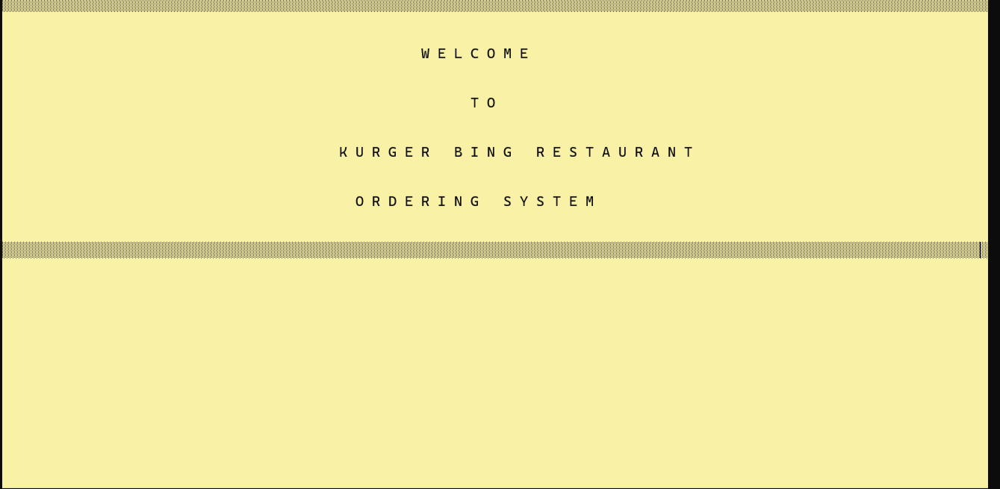
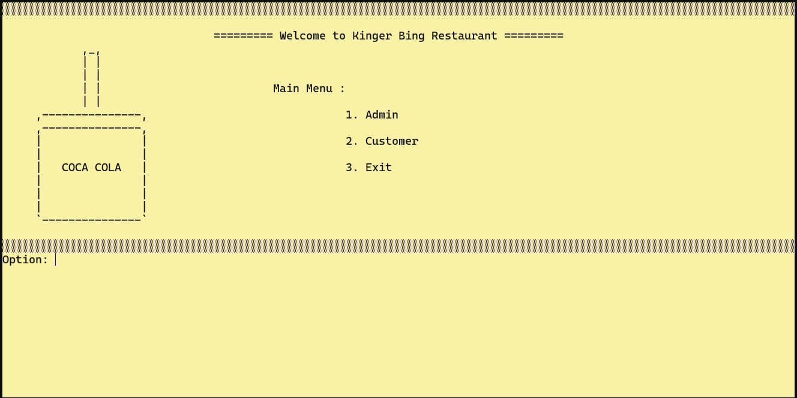
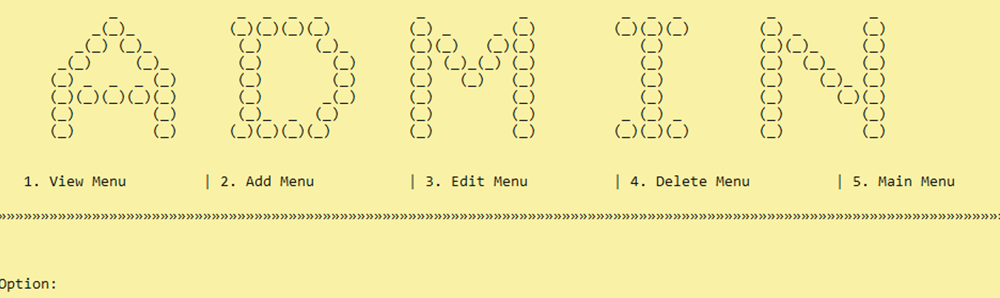
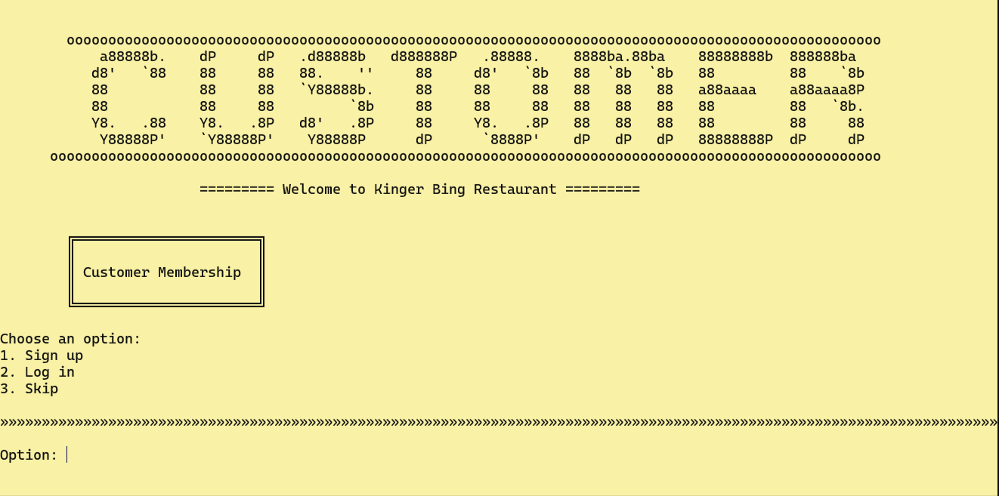
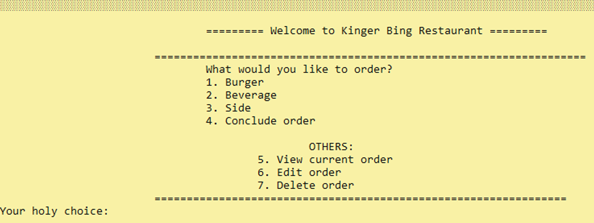
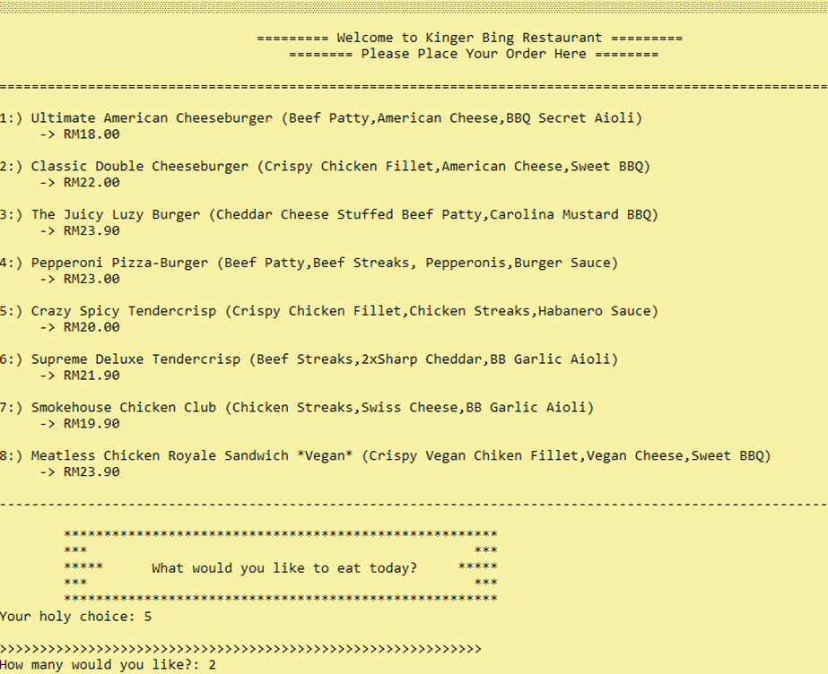
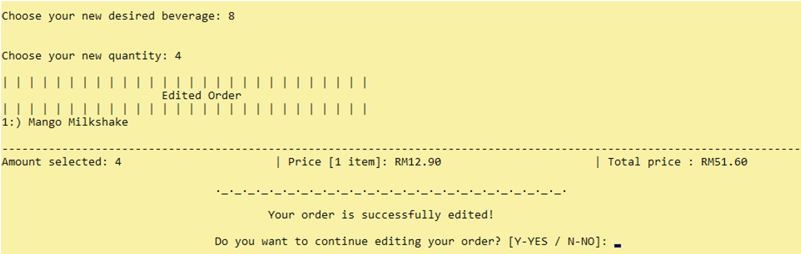
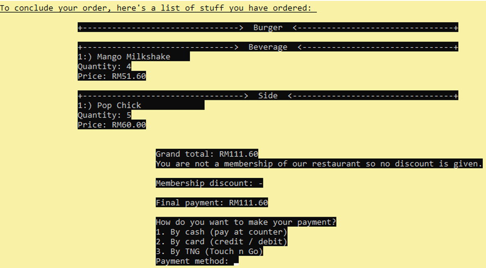
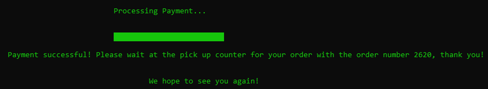

# 🍔 Kurger Bing Restaurant Ordering System

A simple restaurant ordering system developed using the C++ programming language. This system is designed to simplify online food ordering for Kurger Bing Restaurant customers by providing an easy-to-use platform for browsing menus, placing orders, managing carts, and making payments conveniently.

- **Home Screen**
 
 

## 🎯 Project Objectives

- Simplify online food ordering
- Provide user-friendly ordering experience
- Improve restaurant menu management
- Implement secure role-based access system
- Provide membership and discount benefits

## 👥 User Roles

| Role | Permissions |
|---|---|
| Administrator | Add, modify, delete, and browse menu items |
| Customer | Place order, modify cart, membership access |

## ⚙️ Functionalities

### Customer Module
- View menu
- Add food to cart
- Modify order
- Cancel order
- Membership checking
- Discount calculation

### Administrator Module
- Add menu item
- Update menu item
- Delete menu item
- Browse all menu items

## 📷 Screenshots

- **Admin Screen**
 

- **Customer Screen**
 

- **Ordering Screen**
 

- **Menu Screen**
 

- **Edit Order Screen**
 

- **Payment Screen**
 

- **Payment Processing Screen**
 

## 🛠️ Technologies Used

- C++
- Object-Oriented Programming (OOP)
- File Handling
- Console-Based User Interface

## 🚀 How to Run

1. Open the project in any C++ IDE
   - Visual Studio
   - CodeBlocks
   - Dev-C++
   - CLion

2. Compile the source code

3. Run the program

